# wirecov
By Sharon Brizinov

Wireshark/tshark code coverage analysis tool. Builds an instrumented tshark from source inside Docker, runs pcap files through it, and generates detailed coverage reports - including per-dissector breakdowns with GitLab source links.

<p align="center">
  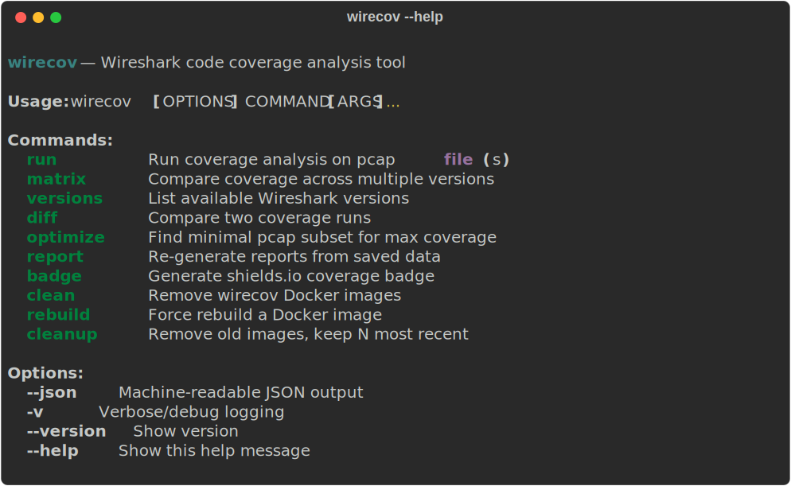
</p>

### Highlights

- **Docker-based** - builds instrumented tshark from source, nothing installed on your host
- **Any Wireshark version** - tags (`v4.6.4`), branches (`master`), or arbitrary commit hashes
- **Multi-version matrix** - compare coverage across versions to spot regressions
- **Diff-from-baseline** - separates init code from actual pcap dissection coverage
- **Per-dissector reports** - HTML (sortable, searchable), JSON, CSV with GitLab source links
- **Pcap set optimizer** - finds the minimal subset of pcaps that achieves maximum coverage
- **Per-pcap attribution** - shows which pcap contributes which lines of coverage
- **Interactive version picker** - fuzzy-searchable dropdown with cached image indicators
- **Coverage badges** - shields.io-compatible JSON endpoint for CI dashboards
- **Incremental builds** - first build takes ~15 min, subsequent runs reuse cached Docker images instantly

## How it works

1. Clones Wireshark from https://gitlab.com/wireshark/wireshark.git at a chosen version and compiles tshark with `--coverage` (gcov) flags inside Docker
2. Captures a **baseline** by running tshark on an empty pcap (measures init-only code: `proto_register_*`, `proto_reg_handoff_*`, plugin loading)
3. Runs your pcap(s) through the instrumented tshark with full dissection (`-V -x -2`)
4. Captures lcov coverage data and generates reports
5. Produces **diff-from-baseline** reports showing only what your pcaps actually exercised (subtracting the init code)

All compilation happens inside Docker - nothing is built on your host machine.

## Requirements

- Python 3.8+
- Docker

## Installation

```bash
python3 -m venv venv
source venv/bin/activate

pip install -e .
```

## Quick start

```bash
# List available Wireshark versions (shows which are already built locally)
wirecov versions

# Run coverage on a single pcap
wirecov run capture.pcap -V v4.4.14

# Run coverage on a directory of pcaps
wirecov run ./pcaps/

# If no version is specified, an interactive picker is shown
wirecov run ./pcaps/

# Use a specific commit hash
wirecov run capture.pcap -V 9a1b2c3d4e5f

# Compare coverage across multiple versions
wirecov matrix ./pcaps/ -V v4.4.14,v4.6.4,master
```

### Example run

<p align="center">
  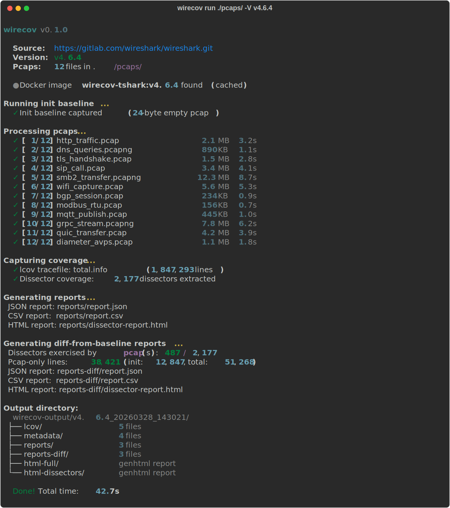
</p>

## Commands

### `wirecov run`

Run coverage analysis on pcap file(s).

```
wirecov run <pcap-path> [OPTIONS]

Options:
  -V, --version TEXT       Wireshark version: tag (v4.4.14), branch (master),
                           or commit hash
  -o, --output DIR         Output directory (default: wirecov-output)
  --no-cache               Force rebuild Docker image
  --format FORMAT          table|json|csv|html|all (default: all)
  -j, --jobs N             Parallel build jobs (0 = auto)
  --per-pcap               Track per-pcap coverage attribution (slower)
  --protocols              Collect protocol tree info
```

`<pcap-path>` accepts a single `.pcap`/`.pcapng`/`.cap` file or a directory (recursive scan).

Each run creates a **timestamped subdirectory** (e.g. `wirecov-output/v4.6.4_20260328_143021/`) so multiple runs don't overwrite each other.

### `wirecov matrix`

Run the same pcaps against multiple Wireshark versions and produce a comparison matrix showing per-dissector differences.

```
wirecov matrix <pcap-path> -V <version1,version2,...> [OPTIONS]

Options:
  -V, --versions TEXT      Comma-separated versions (required)
  -o, --output DIR         Output directory (default: wirecov-output)
  -j, --jobs N             Parallel build jobs (0 = auto)
```

```bash
# Compare two releases
wirecov matrix ./pcaps/ -V v4.4.14,v4.6.4

# Compare release vs master vs a specific commit
wirecov matrix ./pcaps/ -V v4.6.4,master,abc1234def

# Track a regression between patch versions
wirecov matrix ./pcaps/ -V v4.6.2,v4.6.3,v4.6.4
```

Output includes:
- **Version summary** - dissector count, covered count, line rate per version
- **Dissector changes** - per-dissector coverage delta between first and last version
- **`matrix.json`** - full machine-readable comparison data

<p align="center">
  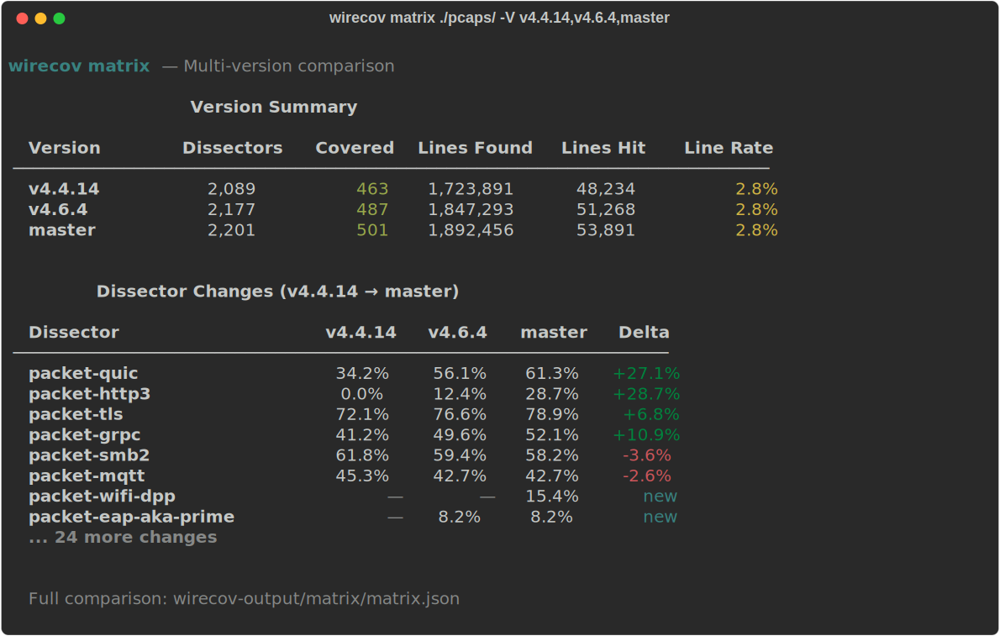
</p>

### `wirecov versions`

List available Wireshark releases from GitLab. Shows the source repository URL and which versions have a locally cached Docker image (ready to run instantly).

```
wirecov versions [--all] [--refresh] [--json]
```

<p align="center">
  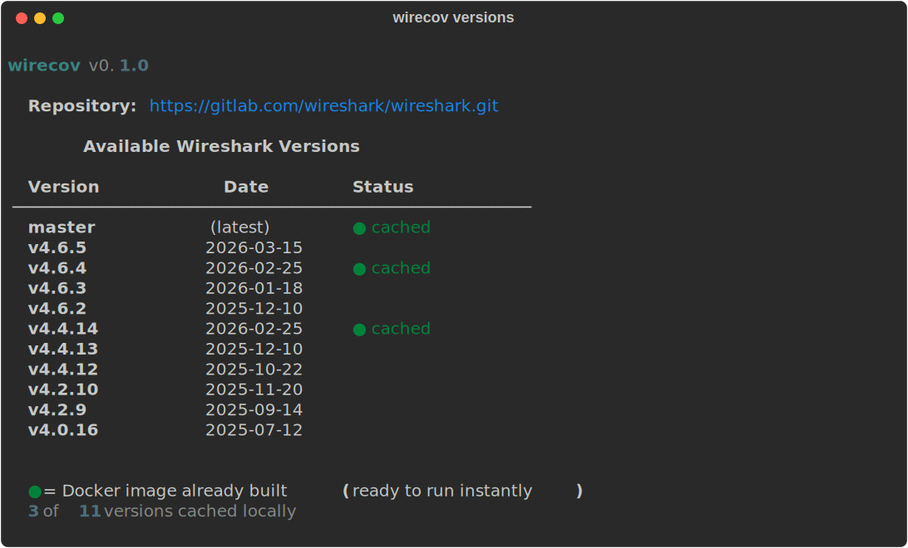
</p>

### `wirecov diff`

Compare two coverage runs and show per-dissector gains/losses.

```
wirecov diff <report-a> <report-b>
```

Accepts `.info` tracefiles, `report.json` files, or output directories.

### `wirecov optimize`

Find the minimal subset of pcaps that achieves maximum coverage (greedy set-cover). Requires a previous run with `--per-pcap`.

```
wirecov optimize <output-dir> [--target 0.95]
```

<p align="center">
  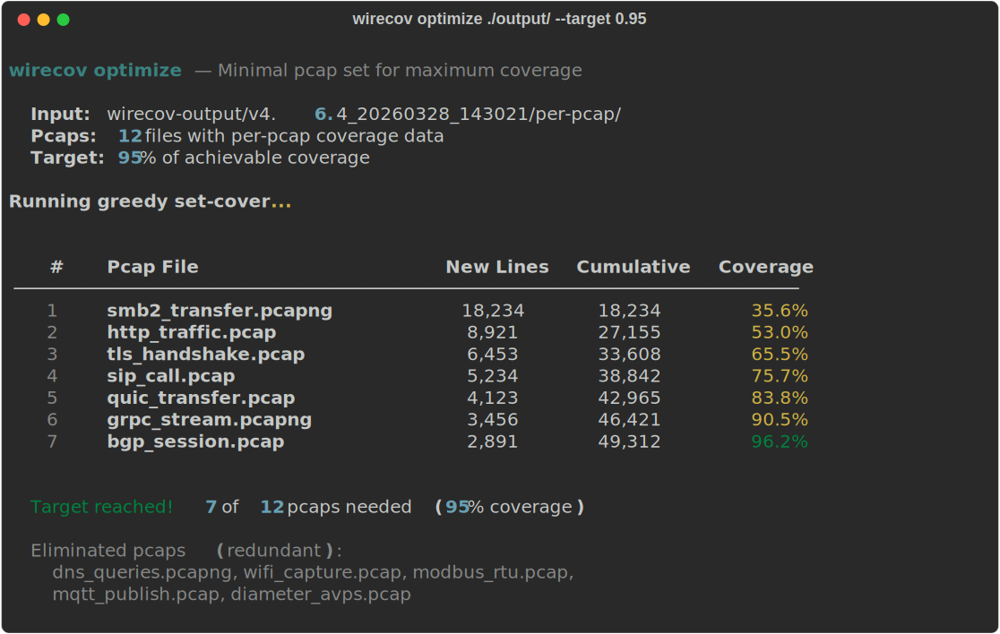
</p>

### `wirecov report`

Re-generate reports from saved coverage data without re-running tshark.

```
wirecov report <coverage-data> [--format all] [-o output-dir]
```

### `wirecov badge`

Generate a [shields.io](https://shields.io) compatible JSON endpoint badge.

```
wirecov badge <coverage-data> [-o badge.json]
```

<p align="center">
  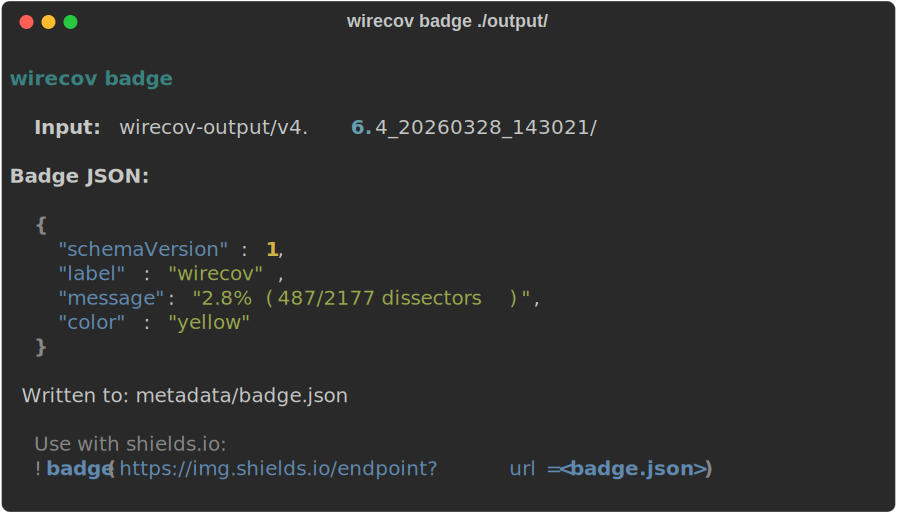
</p>

### `wirecov clean`

Remove wirecov Docker images.

```bash
# Remove a specific version
wirecov clean v4.4.14

# Remove all wirecov images
wirecov clean --all

# List cached images (no arguments)
wirecov clean
```

<p align="center">
  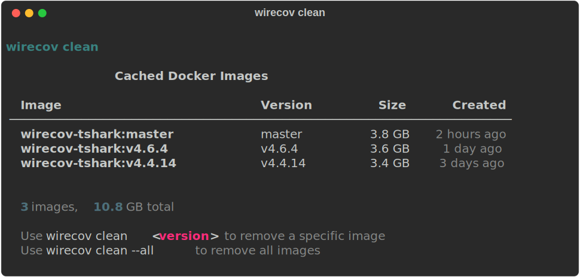
</p>

### `wirecov rebuild`

Remove an existing image and rebuild it from scratch. Always uses `--no-cache`.

```bash
# Rebuild a specific version
wirecov rebuild v4.4.14

# Interactive version picker
wirecov rebuild
```

### `wirecov cleanup`

Remove old wirecov Docker images, keeping the N most recent.

```
wirecov cleanup [--keep 3]
```

## Version input

wirecov accepts three types of version identifiers:

| Type | Example | Notes |
|---|---|---|
| Release tag | `v4.6.4` | Shallow clone (fast) |
| Branch | `master` | Shallow clone (fast) |
| Commit hash | `9a1b2c3d4e5f` | Full clone + checkout (slower first build) |

Tags and branches use `git clone --depth 1 --branch` for speed. Commit hashes require a full clone, so the first build is slower, but the image is cached for reuse like any other version.

## Output directory structure

Each run creates a timestamped directory with the following layout:

```
wirecov-output/v4.6.4_20260328_143021/
├── lcov/                           # Raw lcov tracefiles
│   ├── total.info                  #   Aggregate coverage
│   ├── dissectors.info             #   Dissector-only coverage
│   ├── wireshark.info              #   All Wireshark components
│   ├── init.info                   #   Init-only baseline
│   └── init-dissectors.info        #   Init dissectors baseline
├── metadata/
│   ├── run_metadata.json           #   Version, pcap list, timestamp
│   ├── full_coverage_summary.json  #   Coverage by component
│   ├── badge.json                  #   shields.io endpoint
│   └── dissector_dates.json        #   Git first_created/last_updated
├── reports/                        # Pcap coverage reports
│   ├── dissector-report.html       #   Interactive HTML (sortable, searchable)
│   ├── report.json                 #   Structured JSON
│   └── report.csv                  #   CSV
├── reports-diff/                   # Coverage minus init baseline
│   ├── dissector-report.html       #   What the pcap(s) actually tested
│   ├── report.json
│   └── report.csv
├── html-full/                      # genhtml full coverage report
│   └── index.html
├── html-dissectors/                # genhtml dissectors-only report
│   └── index.html
├── per-pcap/                       # Per-pcap attribution (--per-pcap)
│   └── *.info
└── protocols/                      # Protocol tree data (--protocols)
    └── *.protocols
```

### Report types

- **`reports/`** - Full dissector coverage from your pcap(s), including tshark initialization code
- **`reports-diff/`** - Coverage with init baseline subtracted. This answers: "what code did my pcap(s) actually exercise?" by removing the code that runs on every tshark startup regardless of input. Includes a collapsible section showing unchanged (init-only) dissectors and a stacked bar visualization of init vs pcap-only vs uncovered lines.

## Dissector reports

The dissector summary classifies each of Wireshark's ~2,177 protocol dissectors by coverage level:

| Classification | Coverage |
|---|---|
| none | 0% |
| low | 1–24% |
| medium | 25–74% |
| high | 75–99% |
| full | 100% |

Each dissector entry includes:
- **Numbering** (#) for ranking
- **Source file link** - clickable hyperlink to the source on GitLab (HTML/JSON/CSV)
- **Line and function coverage** with visual bars (HTML)
- **First created / last updated** dates extracted from git history
- **Classification** level

Dissector names use the full source filename (e.g. `packet-tcp`, `packet-ieee8021ah`).

<p align="center">
  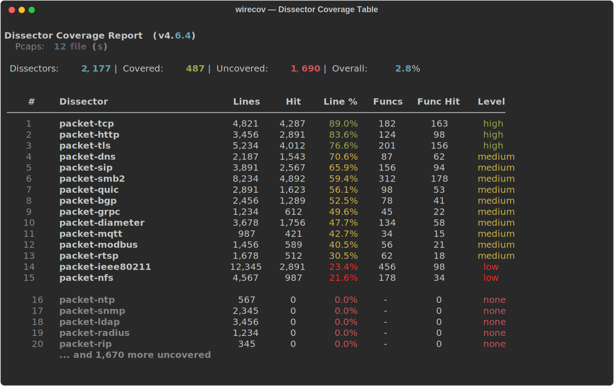
</p>

### HTML report - standard coverage

<p align="center">
  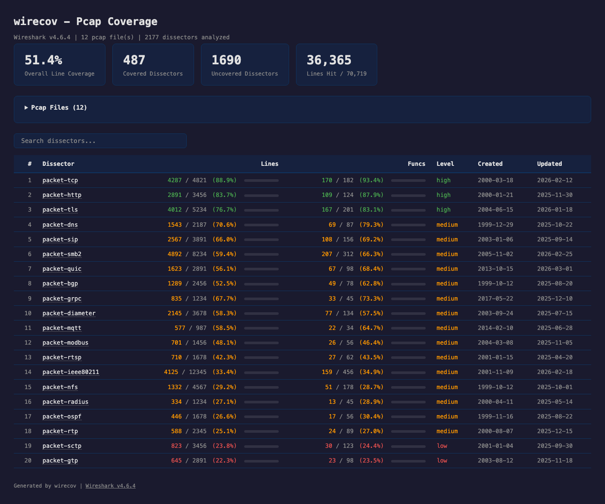
</p>

## Init baseline and diff reports

When tshark starts, it runs initialization code (`proto_register_*`, `proto_reg_handoff_*`) for every dissector - even before looking at any packets. This means even an empty pcap produces significant coverage numbers.

wirecov captures this init coverage by running tshark on a minimal empty pcap (24-byte header, zero packets) before processing your actual pcaps. The **diff reports** (`reports-diff/`) subtract this baseline, showing only the coverage your pcap(s) contributed through actual packet dissection.

The diff report includes enhanced statistics:
- Exercised vs unchanged dissector counts
- Pcap-only lines hit vs init-only lines hit
- Stacked bar: pcap-only (green) / init-only (yellow) / uncovered (gray)
- Classification breakdown for exercised dissectors
- Per-dissector "+Lines from Init" column showing pcap-specific contribution
- Collapsible section listing all unchanged (init-only) dissectors

This is useful for:
- Understanding what protocols your pcap(s) actually exercise
- Finding dissectors where you have packets but poor branch coverage
- Identifying untested code paths beyond basic registration

<p align="center">
  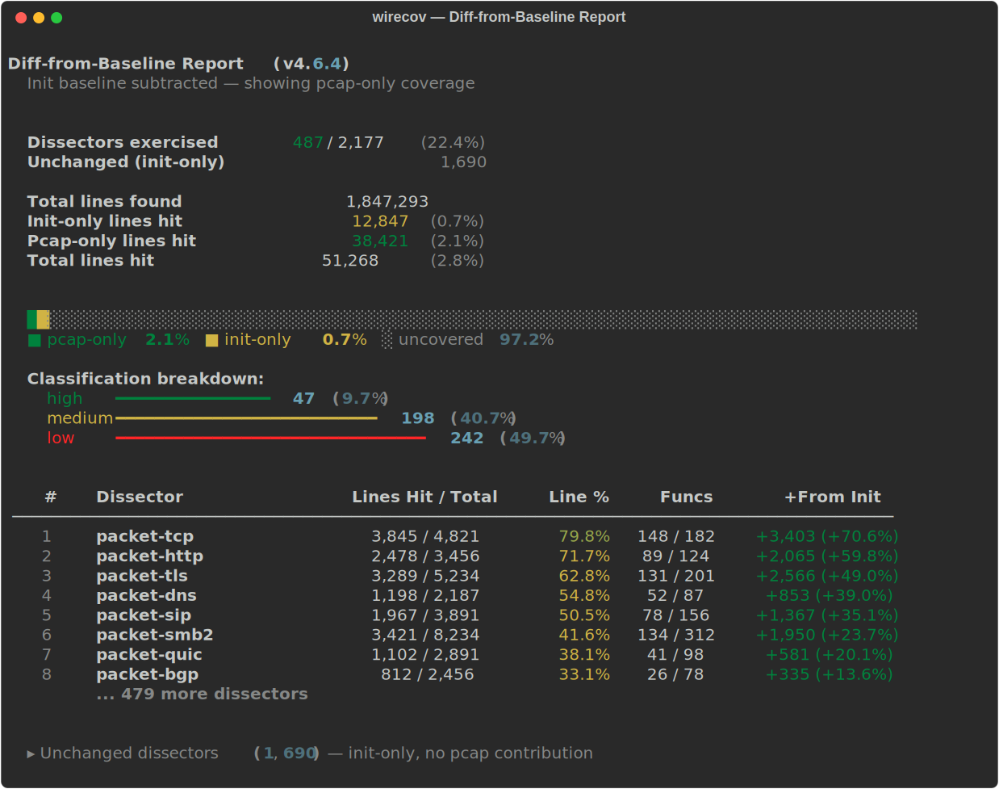
</p>

### HTML report - diff from baseline

[View a live example report](docs/example-report/dissector-diff-init-report.html)

<p align="center">
  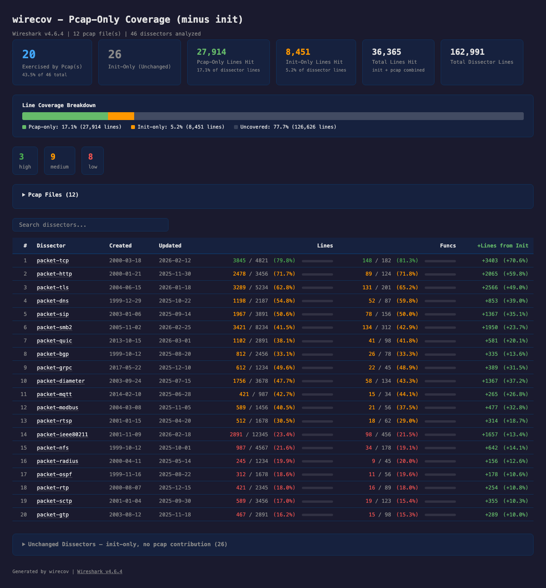
</p>

## Architecture

```
Host (your machine)                    Docker container (ephemeral)
┌──────────────────────────┐          ┌──────────────────────────┐
│ wirecov CLI (Python)     │          │ instrumented tshark      │
│ - orchestration          │  docker  │ - .gcno files (compile)  │
│ - report generation      │   run    │ - .gcda files (runtime)  │
│ - version management     │  --rm   │ - lcov capture           │
│ - diff computation       │          │ - genhtml reports        │
└──────────────────────────┘          └──── deleted on exit ─────┘
```

**Image** (persistent, built once per Wireshark version):
- Full Wireshark build tree with gcov instrumentation
- Baked-in baseline lcov capture
- Dissector git dates (`dissector_dates.json`)
- Tagged as `wirecov-tshark:{version}` (or `wirecov-tshark:{commit}` for commits)

**Container** (ephemeral, fresh per run):
- Clears `.gcda` counters → runs tshark on pcaps → captures lcov
- Writes results to bind-mounted `/output`
- Auto-deleted on exit (`--rm`)

The `docker/entrypoint.sh` is **mounted from your host** at runtime, so changes to the entrypoint don't require rebuilding the image. Only changes to the `Dockerfile` itself (build deps, cmake flags, etc.) require a rebuild.

## When do I need to rebuild?

| What changed | Rebuild needed? |
|---|---|
| `wirecov/*.py`, templates, reports | No - runs on host |
| `docker/entrypoint.sh` | No - mounted at runtime |
| `docker/extract_dates.py` | Yes - runs at build time |
| `Dockerfile` (deps, cmake, etc.) | Yes |

Use `wirecov rebuild <version>` to force a clean rebuild, or `wirecov run --no-cache` to rebuild before running.

## Global options

```
--json       Machine-readable JSON output for all commands
-v           Verbose/debug logging (shows docker commands)
--version    Show wirecov version
```

## License

MIT
